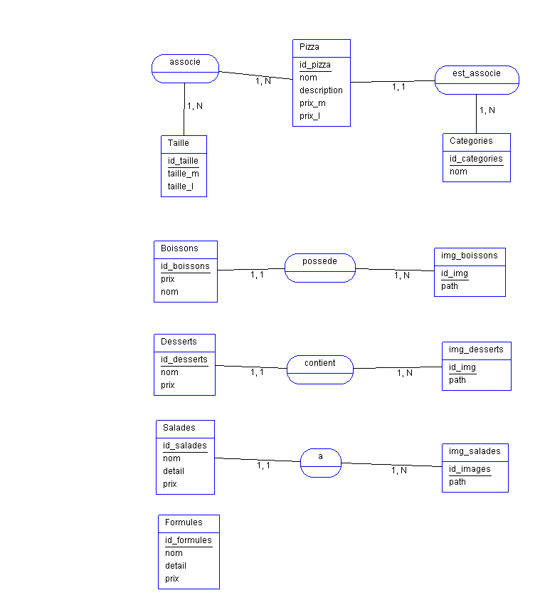

## La Methode Merise

Elle permet la séparation des données et du traitement de ces données.
Elle possède 3 niveaux  : 

- Niveau conceptuel : 

Définition des entités, des associations et des dépendances fonctionnelles.
Le Modèle Conceptuel de Données (MCD) est crée à ce moment la.

- Niveau logique :

On effectue les rélations entre les entités.
Le MLD (Modèle de logique de données) est crée.

- Niveau physique : 

On implémente la base de données
On effectue le Shéma SQL.

Les caratéristiques d'une base de données sont :
- Les tables qui contiennent des données
- 1 donnée par cellule
- Peu de redondance
- Données les plus brutes possibles
- 5 types de données : nombre,texte,booléen,date, image et valeur nulle.

# **Le modèle conceptuel de données MCD** :

C'est l'étape a effectuée avant de concevoir une base de données.
C'est une table qui contient l'id et les champs(nom de la colonne).
Chaque champs à un type.

Exemple :

 

- **L'occurence c'est l'entité avec un exemple** : 

 

- **Les cardinalités** :
 C'est le nombre minimum et maximum de relation entre les tables.
 Elles sont présente de chaque côtés d'une table.Les cardinalités donnent des indications et permettent par la suite de construire la base de données.

Exemple : 

 1 = one
 n = plusieurs / many

Une medecin  peut avoir crée plusieurs potions = 1,n

1 potion peut être vendu d'en plusieur Drustore et plusieurs Drugstore peuvent vendre la même potion = n,n (many to many)

  

 - **Le dictionnaires de données**:

 Il va nous servir à indiquer toutes les informations.
 Le type de données : nombre, booléen etc...

# # **Le modèle logique de données ML
D**  :

Le but est de transformer le MCD en MLD.
C'est le du champs et les caractéristiques qui lui seront attribués

Exemple :

  

Il sert a  bien redfinir les associations de type **1,1 / 1,n ou n,n** pour la formation de Foreign Key (clé primaire d'une autre table intégrée à la table parent) ou de table intermediaire (contient deux clés primaires (id) de deux tables ).
[SQL manuel](https://sql.sh/cours/select)

- Le dictionnaire de données :

Sert à  enregistrer toutes les caractéristiques par rapport aux champs de la table. Il donne les définitions de chaque d'elle, le type de données (nombre, booléen,varchar)..
 

Exemple d'un dictionnaire de données :

 

Le MCD et le MLD sont a effectués directement sur des logiciels, au préalable télécharger [Java](https://www.java.com/fr/).

Et [Analyse SI](https://launchpad.net/analysesi/+download) ou [Mysql WorkBench](https://dev.mysql.com/downloads/workbench/) pour créer un MCD/MLD.

